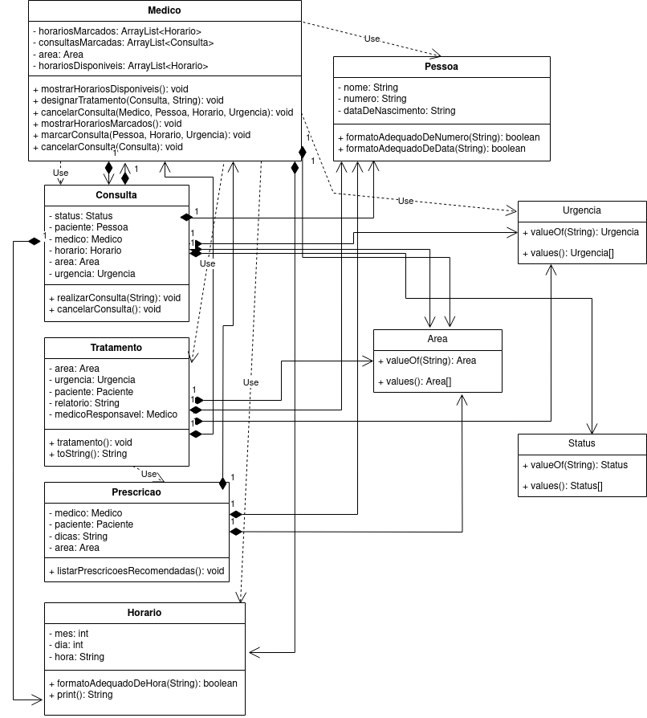

# Sistema de Gerenciamento de Consultas

### 👥 Equipe 👥

|       Nome       | Matrícula |
|:----------------:|:---------:|
|   Arnaldo Lucas  |  22112370 |
|    Jorge Lucas   |  22112410 |
| Gustavo Henrique |  22111978 |

### Descrição do Projeto

#### 🔍 Área  de trabalho
A área do projeto em questão é "Sistemas de Gestão de Serviços" com o tema "Sistema de Gerenciamento de Clínica Médica". Este sistema visa criar um ambiente que ajude o gerenciamento de uma clínica médica, integrando funções de cadastro e manutenção de informações de médicos e pacientes, agendamento de consultas e registro e controle de tratamentos médicos.

#### ⭐️ Importância do Tema
* **Eficiência Operacional:** O sistema melhora a eficiência ao automatizar o agendamento de consultas, reduzindo o tempo gasto em tarefas administrativas.
* **Organização:** Ajuda a organizar os horários dos médicos, tornando o fluxo de trabalho mais organizado e eficaz
* **Melhoria na experiência do paciente:** A melhoria na gestão de consultas e tratamentos proporciona uma experiência positiva aos pacientes, aumentando a satisfação e a fidelidade.
* **Redução de erros:** A automação reduz erros humanos, como agendamentos duplicados ou incorretos.

#### 🎯 Objetivos da Implementação
A ideia é facilitar o agendamento de consultas, registrar tratamentos em andamento ou concluídos e manter informações sobre médicos e pacientes. Temos duas principais entidades no sistema: Médicos e Consultas. Cada médico é representado por uma classe que herda atributos comuns de uma classe base 'Pessoa'. Os médicos têm especializações e horários disponíveis para consultas. Eles podem ser agendados para consultas com pacientes e registrar tratamentos. Os pacientes são representados pela classe 'Pessoa' e podem agendar consultas com médicos.

####  Classes do projeto

---
### Diagrama de Classes

> 
